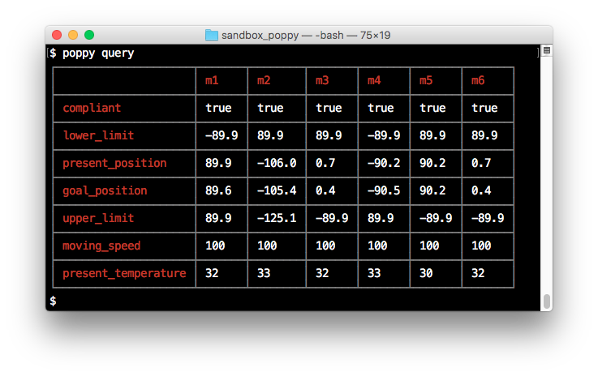
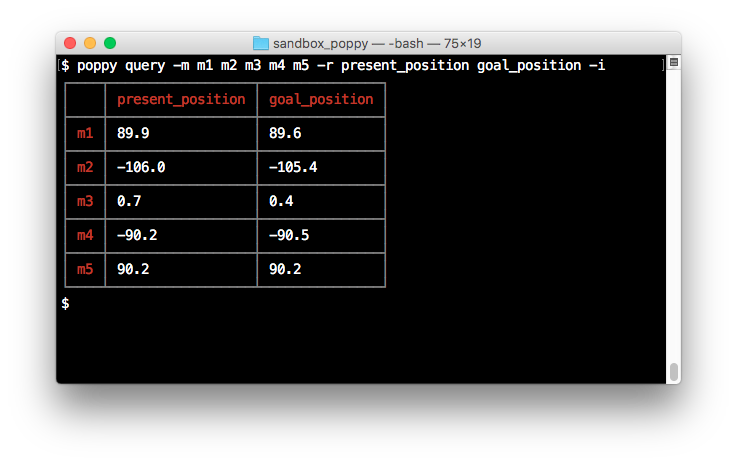
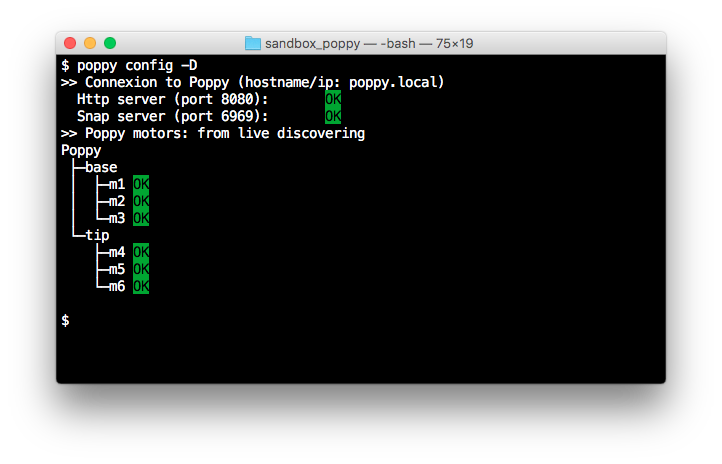

# Poppy Robot Client

[![NPM version][npm-image]][npm-url]

The Poppy Robot Client is a pure client side tool developped in [node.js](https://nodejs.org/en/download/)/javascript which intends to "replace" the snap UI with a __simple programmatic approach__ to drive robots of the [Poppy project](https://www.poppy-project.org/en/) family, or at least the Poppy Ergo Jr.

It allows addressing the poppy robot in 2 modes:
- A [CLI Mode](#cli-mode) to query and send basic set of instructions to the motor registries and then, to allow performing unary 'action' on motors such as move, speed settings, simply typing in a command line terminal,
- A [script exectution mode](#writing-your-own-scripts) to simply combine these basic instructions in order to test more complex motions. It is done writing script using the javascript language where all technical 'difficulties' have been hidden as much as possible and then, it allows users writing their own scripts without any particular knowledges/skills on javascript.

Communications with the robot are based on the REST api exposed by the http server of the pypot library.

Note it has been __first developped and tested with the Poppy Ergo Jr__ and then, it
is configured by default to fit with it but __advanced users' can easily set their own robot configurations__ through a [discovering command](#discovering-robot-configuration) which allows using this project with any set of motors driven through the pypot library.


Furthermore, note these first releases only aims to replace the 'compliant-mode-set-to-false' behaviour (sic) of the motors _i.e._ no motion recording has been developped (yet).

Enjoy, ;)

## Table of Contents

<!-- toc -->

- [TL;DR](#tldr)
- [Getting Started](#getting-started)
  * [Installing node.js](#installing-nodejs)
  * [Installing the poppy-robot-client module](#installing-the-poppy-robot-client-module)
- [Usage](#usage)
- [CLI Mode](#cli-mode)
  * [Querying](#querying)
  * [Executing Single Command](#executing-single-command)
    + [compliant](#compliant)
    + [speed](#speed)
    + [rotate](#rotate)
    + [position](#position)
    + [led](#led)
  * [Configuring Poppy](#configuring-poppy)
    + [Connection Settings](#connection-settings)
    + [Discovering Robot Configuration](#discovering-robot-configuration)
- [Writing your own Scripts](#writing-your-own-scripts)
  * [Initializing Context](#initializing-context)
  * [Creating a Script file](#creating-a-script-file)
    + [File Header](#file-header)
    + [Defining the Scripts themselves](#defining-the-scripts-themselves)
    + [Executing Scripts](#executing-scripts)
- [Examples](#examples)
- [API](#api)
- [Credits](#credits)
- [License](#license)

<!-- tocstop -->

## TL;DR

You just have to install this node module on your local computer, to turn on your Poppy (Ergo Jr, if not read [this](#discovering-robot-configuration)) and enjoy.

The next line will globally install the module on your computer (more details are available [here](#getting-started)):
```shell
npm install poppy-robot-client -g
```

Then type:
```shell
poppy -h
```
To access to the inline help provided with the cli which allows both querying and sending simple command to the motors of the robot.

Note, once the Poppy switches on and ready (green light blinking), the __config__ command must be performed first.

Next to the CLI uses, this module allows users writing their own (simple) scripts to test more complex actions such as some motions, and so on as explained [here](#writing-your-own-scripts). A set of ready-to-use examples (for Poppy Ergo Jr) are provided in another [repository](https://github.com/nbarikipoulos/poppy-examples).

## Getting Started

### Installing node.js

the poppy-robot-client is intented to be used under a node.js 'environment' on your local computer. Thus it should be first installed (sic):
- Downloading it from its [official site](https://nodejs.org/en/download/),
- Or using a node version manager such as nvm (macos/linux version or Windows one are respectively available [here](https://github.com/creationix/nvm) and [there](https://github.com/coreybutler/nvm-windows)).

Note a node.js release equal or higher to 8.0.0 is required.

### Installing the poppy-robot-client module

Once [node.js](https://nodejs.org/en/download/) installed, type:
```shell
npm i poppy-robot-client --global
```
that will globally install the poppy-robot-client module.

To verify that it has been successfully installed, type:
```shell
npm list -g -depth=0
├── npm@6.4.1
└── poppy-robot-client@2.1.0 
```

Then, simply type:

```shell
poppy -h
```
will display the basic help about the poppy-robot-cli.

## Usage

Once installed, both CLI mode and scripting mode are addressable without any other settings.

__Note a specific command must be performed at each Poppy switching on in order to properly initialize the embedded http server in Poppy.__

Next the Poppy robot turns on and is ready (green light blinking), the following command should be performed first:
```shell
poppy config
```

If not performed, the first command/request send to the Poppy next to switching it on will systematically failed, next ones will succeed.

Furthermore, Note for particular/advanced cases, users can configure some Poppy parameters such as connection settings, and so on as explained in a dedicated [section](#configuring-poppy).

## CLI Mode

The cli commands are divided into 3 parts:
- A querying module to get information about the motors,
- A command module which allows sending simple commands to the motors,
- At last, a robot configuration module.

### Querying

First group of cli commands allows querying the register of the motors of the robot.

Typing:
```shell
poppy query
```
will return data about all registers 'of interest' for all motors.



Adding the flag -h will display help for optional options:
- -m to select the motor(s) to query,
- -r to select the register(s) to query,
- -I to invert the output table form register/motor to motor/register.

As example the following line will only display the registry values for 'present_position' and 'goal_position' of the motors m2 to m5:
```shell
poppy query -m m2 m3 m4 m5 -r present_position goal_position -I
```


### Executing Single Command

Next group of cli commands allows executing a single command to targeted motors. It groups a bunch of commands whose helps are accessible through this command:
```shell
poppy exec <command> -h
```

where the &lt;command&gt; are listed in the table below:

name | description
--- | ---
[compliant](#compliant) | modify the 'compliant' state of motor(s)
[speed](#speed) | set the speed of target motor(s)
[rotate](#rotate) | rotate the selected motor(s) by x degrees
[position](#position) | move the selected motor(s) to a given position.
[led](#led) | set the led color of selected motor(s)


All these commands have a common flag '-m'. If not set, a command will be applied to all motors ('m1' to 'm6 for the Poppy Ergo Jr.) excepted if this flag is set on the CLI. In this case, it allows to select the targeted motors on which will apply the command.

As examples:
```shell
poppy exec led -v green
```
will set the led color to green of all motors.

```shell
poppy exec -m m1 m2 -v blue
````
will set the led color of motor m1 and m2 to blue.

Next paragraphs will detail all the available execution commands and their specific options.

#### compliant

This command sets the compliant state of the selected motor(s).

option | desc | value | default | mandatory
--- | --- | --- | --- | ---
-v | set the value of the 'compliant' register | [on, off] | off | no


Examples:

- Switch all motors compliant state to 'false' _i.e._ motors are programmatically addressable:
    ```shell
    poppy exec compliant
    ```
- Same as previous example, but longer...:
    ```shell
    poppy exec compliant -v off
    ```
- Switch all motors to the 'rest' state _i.e._ motors are movable by hand but not programmatically adressable:
    ```shell
    poppy exec compliant -v on
    ```

#### speed

This command sets the the rotation speed of the selected motor(s).

option | desc | value | default | mandatory
--- | --- | --- | --- | ---
-v | set 'goal_speed' register | an integer in the [0, 1023] range | n.a. | yes

Examples:

-  Set the rotation speed of all motors to 100 (slower):
    ```shell
    poppy exec speed -v 100
    ```
- Set the rotation speed of the motors m1 and m2 to 500 (quicker):
    ```shell
    poppy exec speed -m m1 m2 -v 500
    ```

#### rotate

This command rotates the target motor(s) by x degrees from the current position.

option | desc | value | default | mandatory
--- | --- | --- | --- | ---
-v | the rotation by value | integer | n.a. | yes
-w | wait until the rotation will finish | boolean | false | no

Examples:

- Rotate the motors m1 and m2 by -30 degrees and wait until each motors will reach its new position:
    ```shell
    cli exec rotate -m m1 m2 -v -30 -w
    ```

#### position

This command sets the target position of the selected motor(s) _i.e._ it will move these motors to a given positions.

option | desc | value | default | mandatory
--- | --- | --- | --- | ---
-v | set the 'target_position' register| integer | n.a. | yes
-w | wait until the motor(s) will reach this new positions  | boolean | false | no

Examples:

- Move all motors to the 0 degree position asynchrously _i.e._ all motors will reach this position independently:
    ```shell
    poppy exec position -v 0
    ```

- Move all motors to the 0 degree position sequentially _i.e._ for each motor, a request to send this position will be send, and it will await before the end of this action before proceding it to the next motor.:
    ```shell
    poppy exec position -v 0 -w
    ```

- Move the motors m1 and m2 to the 0 degree position and wait until each motors will reach its new position:
    ```shell
    poppy exec position -m m1 m2 -v 90 -w
    ```

#### led

This command sets the led color of the selected motor(s).

option | desc | value | default | mandatory
--- | --- | --- | --- | ---
-v | set the 'led' register| [off, red, green, blue, yellow, cyan, pink, white] | off | no

Examples:

- Turn off the led of all motors:
    ```shell
    poppy exec led
    ```
- Set the led color of motor 'm3' to 'green':
    ```shell
    poppy exec led -m m3 -v green
    ```


### Configuring Poppy

#### Connection Settings

In order to configure the connection to the Poppy robot, a bunch of optional flags are available for both CLI and script mode:

option | desc | value | default
--- | --- | --- | --- 
-i/--ip | Set the Poppy IP/hostname | string | poppy.local
-p/--http-port | Set the http server port on Poppy | integer | 8080
-P/--snap-port | Set the snap server port on Poppy | integer | 6969

For the CLI mode, such options are available as other ones and typing -h will display them in help.

For the script modes, simply typing -h will display help about these options and simply adding these flags at execution time will configure the Poppy context.

As example,
```shell
node myScript.js --ip poppy1.local -p 8081
````

will execute myScript looking for a Poppy with 'poppy1.local' as hostname and with an http server configured on port 8081.

Furthermore, to avoid typing these values each times, users can persist their connection configuration using the 'config' command of the CLI.
Typing:
```shell
poppy config --ip poppy1.local -p 8081 --save
````
will create a local .poppyrc file which handles these settings. __This file will be used for each call of the poppy-robot-client__ (in both CLI and script mode) __executed from this directory__.

Note the poppy-robot-client will:
- First checks if a .poppyrc file exists, and then it extracts its settings,
- On a second hand, use the CLI settings, if any, and then it will override the corresponding values,
- At last, it will override these settings with values passed through the
arguments of this factory.

#### Discovering Robot Configuration

Advanced users can modify the robot configuration in order to fit with others than the default one (aka Poppy Ergo Jr).

Such task could be performed using the config command of the CLI.

it allows:
- Discovering the motor configuration of a target robot,
- Saving it in a descriptor file,
- At last, saving it to the poppyrc file.

Typing
```shell
poppy config -D 
```
will discover the robot here located with the default values for hostname and http port _i.e._ poppy.local and 8080 and display an aliases/motors tree as shown on the screenshot below:



Adding -S flag will save this configuration to a descriptor file:
```shell
poppy config -D -S myPoppy.json
```
which could be use:
- via the poppyrc file:
    - Modifying/creating a .poppyrc file:
        ```js
        {
            "descriptor": "file://myPoppy.json"
        }
        ```
    - Or adding the -s flag over the discovering step to automatically add this line to the .poppyrc file
        ```shell
        poppy config -D -S myPoppy.json -s
        ```
- or programatically through the Poppy object factory or constructor (see [API](./doc/api.md)).

Note Furthermore, the __config__ command allows validating of the current descriptor in use (users\' one or default one) with the targeted robot using the -v flag.


## Writing your own Scripts

Next to the CLI uses, users can write their own scripts to test more complex  combination of actions.

Such scripts are written in javascript language but all technical \'difficulties\' have been hidden as much as possible and then, it allows users writing their own scripts without any particular knowledges/skills on javascript.

Note the same approach has been retained for the  examples located in the [poppy-examples repository](https://github.com/nbarikipoulos/poppy-examples)  _i.e._ their javascript-technical matters are reduced insofar as possible or explained when needed.

Thus, this section will describe the complete _modus operandi_ in order to _ab initio_ create a script file as well as parts about how to write script and execution purposes. 


Next, Users should refers to the [Script API](./doc/api.md#module_poppy-robot-client..Script) for further details.

### Initializing Context

Note: users should have globally installed the poppy-robot-client as explained [earlier](#installing-the-poppy-robot-client-module).

Any script files are javascript files interpreted by the javascript motor embedded in node.js. In order to be able to execute the script feature of the poppy-robot-client, a last operation should be performed: users must first "initialize" their node environment (note this operation must only be performed once).

Open a terminal in the (root) target folder where you expect to write your scripts and type:
```shell
npm link poppy-robot-client
```
it will create a sub-folder named 'node_modules' which simply contains link to the poppy-robot-client module and which allows node.js to reference the poppy-robot-client module when users will execute their scripts (see [here](#executing-scripts)).

### Creating a Script file

#### File Header

All script files should start with the following code:

```js
'use strict'

const P = require('poppy-robot-client');
```

where:
- The first line is a common best pratice rule,
- The second one imports the poppy-robot-client module.

Next to this step, some scripts can be added to the file.

#### Defining the Scripts themselves

The script are defined through a dedicated object named 'Script' (sic) which
owns a bunch of methods in oder to:
- select target motors,
- perform some actions,
- and other basic stuff such as waiting.

As first example let add an initialisation script to our file:

```js
//We hereby declare a new variable init...
let init = P.createScript() //... and affect it a new Script
    .select('all') // we select all motors,
    .speed(150) // and set their speed to 150
    .compliant(false) // at last, we set there compliant state to false
;
```
The first line:
- Creates a new variable named 'init',
- And affects to 'init' a new Script object.

Next lines are call to the 'methods' of Script Object which are fully described in the project API [here](./doc/api.md#module_poppy-robot-client..script).

We can also add other scripts to the file:

```js
let toPosition0 = P.createScript()
    .select('all') // Select all motors...
    .position(0) // ...and move all of them to the 0 degree position.
;

let openGrip = P.createScript() // A new script opening the grip
    .select('m6') // Select the motor 'm6'
    .position(90) //...and move it to the 90 degrees position.
;

let closeGrip = P.createScript() // A new script opening the grip
    .select('m6') // Select the motor 'm6'...
    .position(0)  // ...and move it to the 0 degree position.
;

let end = P.createScript() // another script to 'free' all motors
    .select('all')
    .compliant(true)
;

```

#### Executing Scripts

Once scripts defined, their execution is done through the execution engine handled by an object named Poppy:

Adding to your script file:

```js
let poppy = P.createPoppy(); // Instantiate the Poppy object

poppy.exec( // call the execution engine
    init,
    toPosition0,
    openGrip,
    closeGrip,
    openGrip, // let play the open-close scripts twice
    closeGrip,
    end
);
```
will do the stuff in order to execute the set of scripts passed as arguments to the poppy exec method.

Simply typing:

```shell
node ./myScriptFile.js
```
will execute your scripts.

## Examples

The examples have been moved to a dedicated [repository](https://github.com/nbarikipoulos/poppy-examples).

## API

The API documentation could be found [here](./doc/api.md).

## Credits

- Nicolas Barriquand ([nbarikipoulos](https://github.com/nbarikipoulos))

## License

The poppy-robot-client is MIT licensed. See [LICENSE](./LICENSE.md).

[npm-url]: https://www.npmjs.com/package/poppy-robot-client
[npm-image]: https://img.shields.io/npm/v/poppy-robot-client.svg